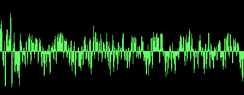

<h1 align="center">Hi 👋, I'm Dark Shadow</h1>
<h3 align="center">A passionate Cyber Security</h3>

- 🔭 I’m currently working on **Cyber Security Projects**

- 👨‍💻 All of my projects are available at [https://github.com/I-am-Dark-Shadow](https://github.com/I-am-Dark-Shadow)

- 💬 Ask me about **Hacking, Python**

- 📫 How to reach me **dark256.256.256.256shadow@gmail.com**

- ⚡ Fun fact **Hacking == (X_X)**

<h3 align="left">Connect with me:</h3>

<h3 align="left">Languages and Tools:</h3>

   

